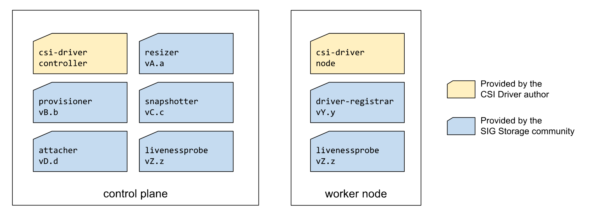
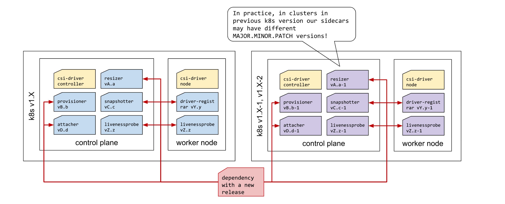
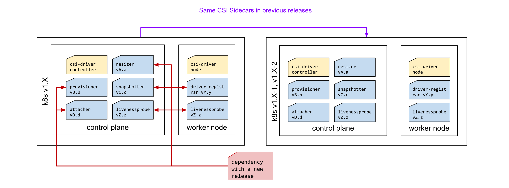
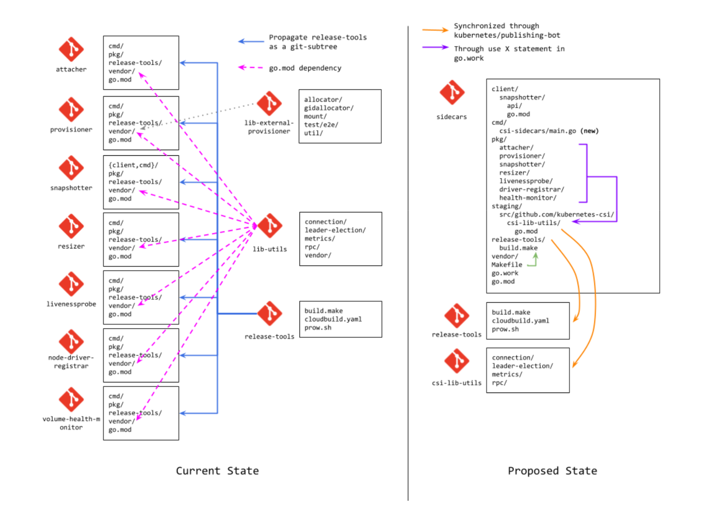
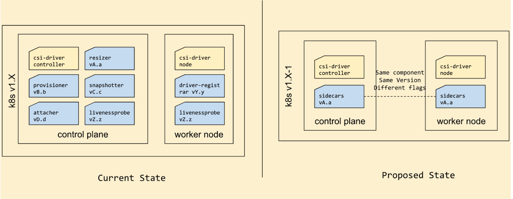

<!--
**Note:** When your KEP is complete, all of these comment blocks should be removed.

To get started with this template:

- [ ] **Pick a hosting SIG.**
  Make sure that the problem space is something the SIG is interested in taking
  up. KEPs should not be checked in without a sponsoring SIG.
- [ ] **Create an issue in kubernetes/enhancements**
  When filing an enhancement tracking issue, please make sure to complete all
  fields in that template. One of the fields asks for a link to the KEP. You
  can leave that blank until this KEP is filed, and then go back to the
  enhancement and add the link.
- [ ] **Make a copy of this template directory.**
  Copy this template into the owning SIG's directory and name it
  `NNNN-short-descriptive-title`, where `NNNN` is the issue number (with no
  leading-zero padding) assigned to your enhancement above.
- [ ] **Fill out as much of the kep.yaml file as you can.**
  At minimum, you should fill in the "Title", "Authors", "Owning-sig",
  "Status", and date-related fields.
- [ ] **Fill out this file as best you can.**
  At minimum, you should fill in the "Summary" and "Motivation" sections.
  These should be easy if you've preflighted the idea of the KEP with the
  appropriate SIG(s).
- [ ] **Create a PR for this KEP.**
  Assign it to people in the SIG who are sponsoring this process.
- [ ] **Merge early and iterate.**
  Avoid getting hung up on specific details and instead aim to get the goals of
  the KEP clarified and merged quickly. The best way to do this is to just
  start with the high-level sections and fill out details incrementally in
  subsequent PRs.

Just because a KEP is merged does not mean it is complete or approved. Any KEP
marked as `provisional` is a working document and subject to change. You can
denote sections that are under active debate as follows:

```
<<[UNRESOLVED optional short context or usernames ]>>
Stuff that is being argued.
<<[/UNRESOLVED]>>
```

When editing KEPS, aim for tightly-scoped, single-topic PRs to keep discussions
focused. If you disagree with what is already in a document, open a new PR
with suggested changes.

One KEP corresponds to one "feature" or "enhancement" for its whole lifecycle.
You do not need a new KEP to move from beta to GA, for example. If
new details emerge that belong in the KEP, edit the KEP. Once a feature has become
"implemented", major changes should get new KEPs.

The canonical place for the latest set of instructions (and the likely source
of this file) is [here](/keps/NNNN-kep-template/README.md).

**Note:** Any PRs to move a KEP to `implementable`, or significant changes once
it is marked `implementable`, must be approved by each of the KEP approvers.
If none of those approvers are still appropriate, then changes to that list
should be approved by the remaining approvers and/or the owning SIG (or
SIG Architecture for cross-cutting KEPs).
-->
# KEP-4958: CSI Sidecars All In One

<!--
This is the title of your KEP. Keep it short, simple, and descriptive. A good
title can help communicate what the KEP is and should be considered as part of
any review.
-->

<!--
A table of contents is helpful for quickly jumping to sections of a KEP and for
highlighting any additional information provided beyond the standard KEP
template.

Ensure the TOC is wrapped with
  <code>&lt;!-- toc --&rt;&lt;!-- /toc --&rt;</code>
tags, and then generate with `hack/update-toc.sh`.
-->

<!-- toc -->
- [Release Signoff Checklist](#release-signoff-checklist)
- [Summary](#summary)
- [Motivation](#motivation)
  - [Goals](#goals)
  - [Non-Goals](#non-goals)
- [Proposal](#proposal)
  - [User Stories (Optional)](#user-stories-optional)
    - [Story 1](#story-1)
    - [Story 2](#story-2)
  - [Notes/Constraints/Caveats (Optional)](#notesconstraintscaveats-optional)
- [Design Details](#design-details)
  - [Modify stateData to be able to store StorageCapacity](#modify-statedata-to-be-able-to-store-storagecapacity)
  - [Get the capacity of nodes for dynamic provisioning](#get-the-capacity-of-nodes-for-dynamic-provisioning)
  - [Scoring of nodes for dynamic provisioning](#scoring-of-nodes-for-dynamic-provisioning)
  - [Conditions for scoring static or dynamic provisioning](#conditions-for-scoring-static-or-dynamic-provisioning)
  - [Test Plan](#test-plan)
      - [Prerequisite testing updates](#prerequisite-testing-updates)
      - [Unit tests](#unit-tests)
      - [Integration tests](#integration-tests)
      - [e2e tests](#e2e-tests)
  - [Graduation Criteria](#graduation-criteria)
    - [Alpha](#alpha)
    - [Beta](#beta)
    - [GA](#ga)
  - [Upgrade / Downgrade Strategy](#upgrade--downgrade-strategy)
  - [Version Skew Strategy](#version-skew-strategy)
- [Production Readiness Review Questionnaire](#production-readiness-review-questionnaire)
  - [Feature Enablement and Rollback](#feature-enablement-and-rollback)
  - [Rollout, Upgrade and Rollback Planning](#rollout-upgrade-and-rollback-planning)
  - [Monitoring Requirements](#monitoring-requirements)
  - [Dependencies](#dependencies)
  - [Scalability](#scalability)
  - [Troubleshooting](#troubleshooting)
- [Implementation History](#implementation-history)
- [Drawbacks](#drawbacks)
- [Alternatives](#alternatives)
  - [Weighting Static Provisioning Scores and Dynamic Provisioning Scores](#weighting-static-provisioning-scores-and-dynamic-provisioning-scores)
- [Infrastructure Needed (Optional)](#infrastructure-needed-optional)
<!-- /toc -->

## Release Signoff Checklist

<!--
**ACTION REQUIRED:** In order to merge code into a release, there must be an
issue in [kubernetes/enhancements] referencing this KEP and targeting a release
milestone **before the [Enhancement Freeze](https://git.k8s.io/sig-release/releases)
of the targeted release**.

For enhancements that make changes to code or processes/procedures in core
Kubernetes—i.e., [kubernetes/kubernetes], we require the following Release
Signoff checklist to be completed.

Check these off as they are completed for the Release Team to track. These
checklist items _must_ be updated for the enhancement to be released.
-->

Items marked with (R) are required *prior to targeting to a milestone / release*.

- [X] (R) Enhancement issue in release milestone, which links to KEP dir in [kubernetes/enhancements] (not the initial KEP PR)
- [] (R) KEP approvers have approved the KEP status as `implementable`
- [x] (R) Design details are appropriately documented
- [] (R) Test plan is in place, giving consideration to SIG Architecture and SIG Testing input (including test refactors)
  - [ ] e2e Tests for all Beta API Operations (endpoints)
  - [X] (R) Ensure GA e2e tests for meet requirements for [Conformance Tests](https://github.com/kubernetes/community/blob/master/contributors/devel/sig-architecture/conformance-tests.md) 
  - [ ] (R) Minimum Two Week Window for GA e2e tests to prove flake free
- [ ] (R) Graduation criteria is in place
  - [ ] (R) [all GA Endpoints](https://github.com/kubernetes/community/pull/1806) must be hit by [Conformance Tests](https://github.com/kubernetes/community/blob/master/contributors/devel/sig-architecture/conformance-tests.md) 
- [ ] (R) Production readiness review completed
- [ ] (R) Production readiness review approved
- [ ] "Implementation History" section is up-to-date for milestone
- [ ] User-facing documentation has been created in [kubernetes/website], for publication to [kubernetes.io]
- [ ] Supporting documentation—e.g., additional design documents, links to mailing list discussions/SIG meetings, relevant PRs/issues, release notes

<!--
**Note:** This checklist is iterative and should be reviewed and updated every time this enhancement is being considered for a milestone.
-->

[kubernetes.io]: https://kubernetes.io/
[kubernetes/enhancements]: https://git.k8s.io/enhancements
[kubernetes/kubernetes]: https://git.k8s.io/kubernetes
[kubernetes/website]: https://git.k8s.io/website

## Summary

We propose to combine the source code of the CSI Sidecars in a monorepo, Instead of just putting the code repositories together, 
it is expected that the program entries for all sidecars will be consolidated.
therefore we can:
- Improve the CSI Sidecar release process by reducing the number of components released
- Decrease the maintenance tasks the SIG Storage community maintainers do to maintain the Sidecars
- Propogate changes in common libraries used by CSI Sidecars immediately instead of through additional PRs
- Reduce the number of components CSI Driver authors and cluster administrators need to keep up to date in k8s clusters

As a side effects of combining the CSI Sidecars into a single component we also
- Reduce the memory usage/API Server calls done by the CSI Sidecars through the usage of a shared informer.
- Reduce the cluster resource requirements need to run the CSI Sidecars

<!--
This section is incredibly important for producing high-quality, user-focused
documentation such as release notes or a development roadmap. It should be
possible to collect this information before implementation begins, in order to
avoid requiring implementors to split their attention between writing release
notes and implementing the feature itself. KEP editors and SIG Docs
should help to ensure that the tone and content of the `Summary` section is
useful for a wide audience.

A good summary is probably at least a paragraph in length.

Both in this section and below, follow the guidelines of the [documentation
style guide]. In particular, wrap lines to a reasonable length, to make it
easier for reviewers to cite specific portions, and to minimize diff churn on
updates.

[documentation style guide]: https://github.com/kubernetes/community/blob/master/contributors/guide/style-guide.md
-->

## Motivation

### Increased maintenance tasks on components maintained by the SIG Storage community
[The SIG Storage community](https://github.com/kubernetes/community/tree/master/sig-storage) maintains many storage related projects, **each on its own git repo** including:
- CSI Drivers - SMB CSI Driver, NFS CSI Driver, Hostpath CSI Driver, ISCSI CSI Driver, NVMf CSI Driver
- CSI Sidecars
  - Typically deployed with the controller component of the CSI Driver: external-attacher, external-provisioner, external-resizer, external-snapshotter, external-health-monitor (alpha), livenessprobe
  - Typically deployed with the node component of the CSI Driver: node-driver-registrar, livenessprobe
- Controllers
  - snapshot-controller, volume-data-source-validator (beta)
- Webhooks
  - csi-snapshot-validation-webhook
- CSI libraries and utilities 
  - csi-lib-utils, csi-release-tools, csi-test, lib-volume-populator (beta)
- Host binaries 
  - CSI Proxy
As part of the maintenance work of these components the SIG Storage community:

1. Bumps the go runtime, Which usually fix vulnerabilities, then the application binary is rebuild and a new image is released. this is done in csi-release tools and propogated to the other repos([example](https://github.com/kubernetes-csi/csi-release-tools/pull/221)) The effort is part of point #3 below.

2. Updates the dependencies to the latest version, which usually have new releases fixing vulnerabilities, the SIG Storage community reviewers/approvers look at every PR generated by a bot and LGTM/approve it. Because we have different repos the human effort is multiplied.  e.g. review # dependencies * # CSI Sidecars PRs ([example](https://github.com/kubernetes-csi/livenessprobe/pull/195)) 

3. Propogates changes in CSI related dependencies across all the CSI sidecars and CSI Drivers that need them. csi-release-tools has common build utilities used across all the repos, whenever there's a change in this component it's need to be propogated across all the repos.[(example)](https://github.com/kubernetes-csi/node-driver-registrar/pull/293).
Because we have different repos the human effort is multiplied e.g. make (# updates in csi-release-tools + # new changes in csi-lib-utils) * # CSI Sidecars.

To keep dependencies up to date the SIG Storage community uses  https://github.com/dependabot which is a bot that automatically creates a PR whenever a dependency creates a new release. As a side effect, after enabling the bot the number of PRs increased. Also note that because each component is on its own repo a bump in a dependency(assuming that the dependency is shared among many CSI Sidecars) is multiplied accross of them.

Stats for dependency/vuln updates across CSI Sidecars as of Aug 11th, 2023.

| CSI Sidecar \ PRs reviewed & merged | Dependabot dependency update | csi-release-tools propagation      | csi-lib-utils        | 
|-----------------|----------------------|-------------------|---------------|
| [external-attacher](https://github.com/kubernetes-csi/external-attacher/pulls?page=2&q=is%3Apr+sort%3Aupdated-desc+is%3Amerged+author%3Aapp%2Fdependabot)         | 14(unreleased) <br> 12 (release 4.3.0) <br>  8 (release 4.2.0)          | [2](https://github.com/kubernetes-csi/external-attacher/pulls?q=is%3Apr+sort%3Aupdated-desc+is%3Amerged+updated%3A%3E%3D2023-06-22+csi-release-tools+) (unreleased)~[71](https://github.com/kubernetes-csi/external-attacher/pulls?q=is%3Apr+sort%3Aupdated-desc+is%3Amerged+csi-release-tools+) (lifetime)           | ~[15](https://github.com/kubernetes-csi/external-attacher/pulls?q=is%3Apr+sort%3Aupdated-desc+is%3Amerged+%22csi-lib-utils%22+) (lifetime) |
| [external-provisioner](https://github.com/kubernetes-csi/external-provisioner/pulls?q=is%3Apr+sort%3Aupdated-desc+is%3Amerged+author%3Aapp%2Fdependabot)        | [36](https://github.com/kubernetes-csi/external-provisioner/pulls?q=is%3Apr+sort%3Aupdated-desc+is%3Amerged+author%3Aapp%2Fdependabot+updated%3A%3E%3D2023-06-22) (unreleased) <br> 30 (release 3.5.0) <br> 11 (release 3.4.0) | [2](https://github.com/kubernetes-csi/external-provisioner/pulls?q=is%3Apr+sort%3Aupdated-desc+is%3Amerged+updated%3A%3E%3D2023-06-22+csi-release-tools+) (unreleased)~[75](https://github.com/kubernetes-csi/external-provisioner/pulls?q=is%3Apr+sort%3Aupdated-desc+is%3Amerged+csi-release-tools+) (lifetime)        | ~[19](https://github.com/kubernetes-csi/external-provisioner/pulls?q=is%3Apr+sort%3Aupdated-desc+is%3Amerged+%22csi-lib-utils%22+) (lifetime) |
| [external-resizer](https://github.com/kubernetes-csi/external-resizer/pulls?q=is%3Apr+sort%3Aupdated-desc+is%3Amerged+author%3Aapp%2Fdependabot)         | 5 (release 1.8.0) <br> 5 (release 1.7.0)      | [2](https://github.com/kubernetes-csi/external-resizer/pulls?q=is%3Apr+sort%3Aupdated-desc+is%3Amerged+updated%3A%3E%3D2023-06-22+csi-release-tools+) (unreleased)~[62](https://github.com/kubernetes-csi/external-resizer/pulls?q=is%3Apr+sort%3Aupdated-desc+is%3Amerged++csi-release-tools+) (lifetime) | ~[10](https://github.com/kubernetes-csi/external-resizer/pulls?q=is%3Apr+sort%3Aupdated-desc+is%3Amerged+%22csi-lib-utils%22+) (lifetime) | 
| [external-snapshotter](https://github.com/kubernetes-csi/external-snapshotter/pulls?q=is%3Apr+sort%3Aupdated-desc+is%3Amerged+author%3Aapp%2Fdependabot)         | 14 (unreleased)      | ~[90](https://github.com/kubernetes-csi/external-snapshotter/pulls?q=is%3Apr+sort%3Aupdated-desc+is%3Amerged+csi-release-tools+) (lifetime)           | ~[19](https://github.com/kubernetes-csi/external-snapshotter/pulls?q=is%3Apr+sort%3Aupdated-desc+is%3Amerged+%22csi-lib-utils%22+) (lifetime) |
| [node-driver-register](https://github.com/kubernetes-csi/node-driver-registrar/pulls?page=1&q=is%3Apr+sort%3Aupdated-desc+is%3Amerged+author%3Aapp%2Fdependabot)         | 13 (unreleased) <br> 8 (release 2.8.0) <br> 2 (release 2.7.0) <br> 3 (release 2.6.0)| ~[70](https://github.com/kubernetes-csi/node-driver-registrar/pulls?q=is%3Apr+sort%3Aupdated-desc+is%3Amerged+csi-release-tools+) (lifetime)           | ~[7](https://github.com/kubernetes-csi/node-driver-registrar/pulls?q=is%3Apr+sort%3Aupdated-desc+is%3Amerged+%22csi-lib-utils%22+) (lifetime) | 
| [livenessprobe](https://github.com/kubernetes-csi/livenessprobe/pulls?page=1&q=is%3Apr+sort%3Aupdated-desc+is%3Amerged+author%3Aapp%2Fdependabot)         | 9 (unreleased)       |     ~[41](https://github.com/kubernetes-csi/livenessprobe/pulls?q=is%3Apr+sort%3Aupdated-desc+is%3Amerged+csi-release-tools+) (lifetime)       | ~[9](https://github.com/kubernetes-csi/livenessprobe/pulls?q=is%3Apr+sort%3Aupdated-desc+is%3Amerged+%22csi-lib-utils%22+) (lifetime) | 

Table: PR to CSI Sidecars related to vuln fixes and library propagation


#### CSI Sidecars releases

The CSI Drivers/CSI Sidecars have an indirect dependency on the k8s version. This could happen because of:
- A new CSI feature that touches CSI Sidecars and k8s component - For example the [ReadWriteOncePod](https://kubernetes.io/blog/2021/09/13/read-write-once-pod-access-mode-alpha/) feature needs changes in k8s components (kube-apiserver, the kube-scheduler, the kubelet), CSI Sidecars

Because of this indirect dependency the SIG Storage community creates a minor release of each CSI Sidecar for every k8s minor release. We use csi-hospath (a CSI Driver used for testing purposes) to test the compatibility of the new releases with the latest k8s version.

We follow the instructions on [SIDECAR_RELEASE_PROCESS.md](https://github.com/kubernetes-csi/csi-release-tools/blob/master/SIDECAR_RELEASE_PROCESS.md) on every CSI Sidecar to create a minor release.


### Maintenance tasks by CSI Driver authors and cluster administrators

Kubernetes and CSI are constantly evolving（see the section above on how CSI Sidecars evolve）and so are CSI Drivers, CSI Driver authors must keep their drivers up to date with the new features in k8s and CSI. A CSI Driver implementing most of the CSI features inludes the following components:



#### keeping up with vulnerabilities with fixes

A cluster administrator in addition to keeping up with the latest k8s and CSI features might need to manage different aspect of the integration too like security. CSI Sidecars depend on multiple dependencies which might be susceptible to vulnerabilities. In the case these vulnerabilities are fixed in a new release of a dependency it must be propagated all the way until the CSI Sidecar repository.

Usually the above might be enough for the latest release however the vulnerability might also affest older releases of the CSI Sidecars, therefore the fix needs to be appliedto older CSI Sidecar releases



The above increases the work not only for the SIG Storage community which has to cherry pick the fix but also to cluster administrators who have to update existing CSI Driver integrations in previous k8s releases bumping the CSI Sidecars

To avoid this propogation issue, cluster administrators have the following options:
- Use the same version of CSI Sidecars in previous k8s integrations




### Resource utilization by the CSI Sidecar components

In Some CSI Driver control plane deployment setups each sidecar is configured with a minimum memory request, some examples of OSS CSI Driver deployments resource allocations:
- Memory request
  - EBS CSI Driver
    - In a CP node, sets a [40Mi memory request](https://github.com/kubernetes-sigs/aws-ebs-csi-driver/blob/a85fb6358eae7b83a083eb8003cf929b3f31d413/charts/aws-ebs-csi-driver/values.yaml#L234) for each CSI Sidecars(5 sidecars), a total of 200Mi per node.
    - In a worker node, sets a [40Mi memory request](https://github.com/kubernetes-sigs/aws-ebs-csi-driver/blob/a85fb6358eae7b83a083eb8003cf929b3f31d413/charts/aws-ebs-csi-driver/values.yaml#L323) for each CSI Sidecar(2 sidecars), a total of 80Mi per node
  - Azuredisk
    - In a CP node, sets a [20Mi memory request](https://github.com/kubernetes-sigs/azuredisk-csi-driver/blob/30d9bbfde6612c43aa5103bcf4fe4e1e70815892/charts/latest/azuredisk-csi-driver/values.yaml#L78) for each CSI Sidecars(5 sidecars), a total of 100Mi per node
    - In a worker node, sets a [20Mi memory request](https://github.com/kubernetes-sigs/azuredisk-csi-driver/blob/30d9bbfde6612c43aa5103bcf4fe4e1e70815892/charts/latest/azuredisk-csi-driver/values.yaml#L78) for each CSI Sidecars(2 sidecars), a total of 40Mi per node
  - AlibabaCloud Disk
    - In a CP node, sets a [16Mi memory request](https://github.com/kubernetes-sigs/alibaba-cloud-csi-driver/blob/9819c8b575acb5eadfb6fada4e42a4add2453c18/deploy/chart/templates/controller.yaml#L106) for each CSI Sidecars(average 4 sidecars) a total of 64Mi per node
    - In a worker node, sets a [16Mi memory request](https://github.com/kubernetes-sigs/alibaba-cloud-csi-driver/blob/9819c8b575acb5eadfb6fada4e42a4add2453c18/deploy/chart/templates/plugin.yaml#L82) for each CSI Sidecars(1 sidecars), a total of 40Mi per node
The 5x memory request is addtional overhead in the control plane nodes, 2x in the worker nodes

### Goals

-  To combine the source code of the CSI Sidecars in a monorepo, Instead of just putting the code repositories together.

<!--
List the specific goals of the KEP. What is it trying to achieve? How will we
know that this has succeeded?
-->

### Non-Goals

-  Not include [sig-storage-lib-external-provisioner](https://github.com/kubernetes-sigs/sig-storage-lib-external-provisioner). It doesn't depend on release-tools or csi-lib-utils. 


<!--
What is out of scope for this KEP? Listing non-goals helps to focus discussion
and make progress.
-->

## Proposal

### Overview

The proposal consists of creating a monorepo which creates a single artifact with common sidecars combined in one binary:
- Combine the source code of all common CSI sidecars (external-attacher, external-provisioner, external-resizer, external-snapshotter, livenessprobe, node-driver-registrar), Controllers(snapshot controller, volume-health-monitor controller), Webhooks(csi-snapshot-validation-webhook) in a single repository. ***A total of 7 repositories including 6 sidecars, 2 controllers and 1 webhook.***
- Include the source code of helper utilities in the same repository([csi-release-tools](https://github.com/kubernetes-csi/csi-release-tools), [csi-lib-utils](https://github.com/kubernetes-csi/csi-lib-utils)), sidecars/apps use the local modules through go workspaces. A total of 1 release helper and 1 go module.
- Create a new cmd/ entrypoint that enables sidecars selectively, similar to kube-controller-manager and the --controllers flag.



CSI Driver authors would include a single sidecar in their deployments(in both the control plane and node pools). while the artifact version is the same, the command/arguments will be differents.

pictures:


The CSI Driver deployment manifest would look like this in the control plane:

```yaml
kind: Deployment
apiVersion: app/v1
metadata:
  name: csi-driver-deployment
spec:
  replicas: 1
  templates:
    spec:
      containers:
        - name: csi-driver
          args:
            - "--v=5"
            - "--endpoint=unix:/csi/csi.sock"
        - name: csi-sidecars
          command:
            - csi-sidecars
            - "--csi-address=unix:/csi/csi.sock"
            # similar style as kube-controller-manager
            - "--controllers=attacher,provisioner,resizer,snapshotter"
            - "--feature-gates=Topology=true"
            # leader election flags for all the components as one
            - "--leader-election"
            - "--leader-election-namespace=kube-system"
            # global timeouts
            - "--timeout=30s"
            # per controller specific flags are prefixed with the component name
            - "--attacher-timeout=30s"
            - "--attacher-worker-thread=100"
            - "--provisioner-timeout=30s"
          volumeMounts:
            - mountPath: /csi
              name: socket-dir
```

The CSI Driver deployment manifest would look like this in the worker node

```yaml
kind: DaemonSet
apiVersion: apps/v1
metadata:
  name: csi-driver-deployment
spec:
  template:
    spec:
      containers:
        - name: csi-driver
          args:
            - "--v=5"
            - "--endpoint=unix:/csi/csi.sock"
        - name: csi-sidecars
          command:
            - csi-sidecars
            - "--csi-address=unix:/csi/csi.sock"
            # similar style as kube-controller-manager
            - "--controllers=node-driver-registrar"
            - "--kubelet-registration-path=/var/lib/kubelet/plugins/<csi-driver>/csi.sock"
          volumeMounts:
            - name: registration-dir
              mountPath: /registration
            - name: plugin-dir
              mountPath: /csi
      volumes:
        - name: registration-dir
          hostPath:
            path: /var/lib/kubelet/plugins_registry/
            type: Directory
        - name: plugin-dir
          hostPath:
            path: /var/lib/kubelet/plugins/<csi-driver>/
            type: DirectoryOrCreate
```

Quantifiable characteristics of the current state and of the proposed state


| Characteristics/State | Current state of CSI Sidecars(let #csi-sidecars=6)|  CSI Sidecars in signal component    | 
|-----------------|----------------------|-------------------|
|  Human effort of propogating csi-release-tools        |  (#csi-release-tools changes * #csi-sidecars)          |    0(because csi-release-tools is part of the repo)     | 
|  Human effort of propogating csi-lib-utils        |  (#csi-lib-utils changes * #csi-sidecars)          |    0(because csi-lib-utils is part of the repo)     | 
|  go mod dependency bumps        |  (#dependency changes * #csi-sidecars) * CSI release supported(unknown)          |   #dependency changes * releases supported(follow k8s release)    | 
|  runtime udpate  |  (#csi-release-tools changes related with go runtime updates * #csi-sidecars)        |   #go runtime updates | 
|  members of CSI releases per k8s minor release  |   #csi-sidecars     |   1 | 


Additional properties of a single CSI Sidecar component without a quantifiable benefit:


| Dimension | Pros |   Cons  | 
|-----------------|----------------------|-------------------|
|  Releases        |  <li> Easier releases <li> Better definition of which sidecar releases are supported for CVE fixs i.e. if our model of support is similar to k8s (last 3 releases) then the same applies to the CSI sidecar releases <li> Release nodes in csi-release-tools are part of the release. Currently, [commits in csi-release-tools with release notes get lost](https://github.com/kubernetes-csi/node-driver-registrar/pull/235) because the git subtree commands replays commits but loses the PR release note if csi-release-tools is part of the repo        |     <li> No longer able to do single releases per component.<li> More frequent major version bumps, Currently, we increase the major version of a sidecar when we remove a command line parameter or require new RBAC rules, We ended up with provisioner v5, attacher v4, and snapshotter v8. With a common repo, we would end up with 5+4+8=v17 in the worst case.  | 
|  Testability        |   <li> [Easier testing](https://slideshare.net/sttts/cutting-the-kubernetes-monorepo-in-pieces-never-learnt-more-about-git) <li> Test features that spawn multiple components e.g. the RWOP feature can be tested as a whole. @pohly  |       | 
|  Performance & Reliability       |  <li> Can use a shared informer decreasing the load on the API server. @msau42  |  <li> Container getting OOMKilled kills the entire CSI machinery, not just a single component.<ul><li>In HA, another replica would take over a few seconds.   | 
|  Simplicity    |  <li> Consolidation of common parameters like leader election, structed logging<ul><li>Avoids duplication of some features e.g. [structured logging](https://github.com/kubernetes-csi/livenessprobe/pull/202) would be implemented only once [instead of #csi-sidecar times](https://github.com/kubernetes-csi/livenessprobe/pull/202#issuecomment-1682406525)) @msau42</ul> <li> Combination of metrics/health ports @msau42 <li> Enables using additional sidecars that aren't used because of addtional build pipelines that might be needed to support that additional component.  |  <li> Logs would be interleaved making it harder to trace what happened for a request <li> CSI utility liraries that are not only used by CSI Sidecars but by other project. <ul><li> make an external repo which is automatically syncronized from the internal csi-release-tools e.g. a similar analogy to k/k/staging/lib -> k/lib  | 
|  Integration with CSI Drivers    |   <li> Less config in the controller/node yaml manifest <li>Less confusion for CSI Driver authors on which CSI Sidecar versions to use @msau42  |   <li> Complex configuration for the single CSI Sidecar component <li> Difficulty expressing per CSI Sidecar configration  e.g. kube-api-qps, kube-qpi-burst <ul><li> global flag, override through a CSI sidecar flag  e.g. kube-api-qps -> attacher-kube-api-qps | 


<!--
This is where we get down to the specifics of what the proposal actually is.
This should have enough detail that reviewers can understand exactly what
you're proposing, but should not include things like API designs or
implementation. What is the desired outcome and how do we measure success?.
The "Design Details" section below is for the real
nitty-gritty.
-->

### User Stories (Optional)

<!--
Detail the things that people will be able to do if this KEP is implemented.
Include as much detail as possible so that people can understand the "how" of
the system. The goal here is to make this feel real for users without getting
bogged down.
-->

### Notes/Constraints/Caveats (Optional)

<!--
What are the caveats to the proposal?
What are some important details that didn't come across above?
Go in to as much detail as necessary here.
This might be a good place to talk about core concepts and how they relate.
-->

## Design Details

<!--
This section should contain enough information that the specifics of your
change are understandable. This may include API specs (though not always
required) or even code snippets. If there's any ambiguity about HOW your
proposal will be implemented, this is the place to discuss them.
-->


### Test Plan

<!--
**Note:** *Not required until targeted at a release.*
The goal is to ensure that we don't accept enhancements with inadequate testing.

All code is expected to have adequate tests (eventually with coverage
expectations). Please adhere to the [Kubernetes testing guidelines][testing-guidelines]
when drafting this test plan.

[testing-guidelines]: https://git.k8s.io/community/contributors/devel/sig-testing/testing.md
-->


##### Prerequisite testing updates

<!--
Based on reviewers feedback describe what additional tests need to be added prior
implementing this enhancement to ensure the enhancements have also solid foundations.
-->


##### Unit tests

<!--
In principle every added code should have complete unit test coverage, so providing
the exact set of tests will not bring additional value.
However, if complete unit test coverage is not possible, explain the reason of it
together with explanation why this is acceptable.
-->

<!--
Additionally, for Alpha try to enumerate the core package you will be touching
to implement this enhancement and provide the current unit coverage for those
in the form of:
- <package>: <date> - <current test coverage>
The data can be easily read from:
https://testgrid.k8s.io/sig-testing-canaries#ci-kubernetes-coverage-unit

This can inform certain test coverage improvements that we want to do before
extending the production code to implement this enhancement.
-->


##### Integration tests

<!--
This question should be filled when targeting a release.
For Alpha, describe what tests will be added to ensure proper quality of the enhancement.

For Beta and GA, add links to added tests together with links to k8s-triage for those tests:
https://storage.googleapis.com/k8s-triage/index.html
-->


##### e2e tests

<!--
This question should be filled when targeting a release.
For Alpha, describe what tests will be added to ensure proper quality of the enhancement.

For Beta and GA, add links to added tests together with links to k8s-triage for those tests:
https://storage.googleapis.com/k8s-triage/index.html

We expect no non-infra related flakes in the last month as a GA graduation criteria.
-->

### Graduation Criteria

<!--
**Note:** *Not required until targeted at a release.*

Define graduation milestones.

These may be defined in terms of API maturity, [feature gate] graduations, or as
something else. The KEP should keep this high-level with a focus on what
signals will be looked at to determine graduation.

Consider the following in developing the graduation criteria for this enhancement:
- [Maturity levels (`alpha`, `beta`, `stable`)][maturity-levels]
- [Feature gate][feature gate] lifecycle
- [Deprecation policy][deprecation-policy]

Clearly define what graduation means by either linking to the [API doc
definition](https://kubernetes.io/docs/concepts/overview/kubernetes-api/#api-versioning)
or by redefining what graduation means.

In general we try to use the same stages (alpha, beta, GA), regardless of how the
functionality is accessed.

[feature gate]: https://git.k8s.io/community/contributors/devel/sig-architecture/feature-gates.md
[maturity-levels]: https://git.k8s.io/community/contributors/devel/sig-architecture/api_changes.md#alpha-beta-and-stable-versions
[deprecation-policy]: https://kubernetes.io/docs/reference/using-api/deprecation-policy/

Below are some examples to consider, in addition to the aforementioned [maturity levels][maturity-levels].

#### Alpha

- Feature implemented behind a feature flag
- Initial e2e tests completed and enabled

#### Beta

- Gather feedback from developers and surveys
- Complete features A, B, C
- Additional tests are in Testgrid and linked in KEP

#### GA

- N examples of real-world usage
- N installs
- More rigorous forms of testing—e.g., downgrade tests and scalability tests
- Allowing time for feedback

**Note:** Generally we also wait at least two releases between beta and
GA/stable, because there's no opportunity for user feedback, or even bug reports,
in back-to-back releases.

**For non-optional features moving to GA, the graduation criteria must include
[conformance tests].**

[conformance tests]: https://git.k8s.io/community/contributors/devel/sig-architecture/conformance-tests.md

#### Deprecation

- Announce deprecation and support policy of the existing flag
- Two versions passed since introducing the functionality that deprecates the flag (to address version skew)
- Address feedback on usage/changed behavior, provided on GitHub issues
- Deprecate the flag
-->


### Upgrade / Downgrade Strategy

<!--
If applicable, how will the component be upgraded and downgraded? Make sure
this is in the test plan.

Consider the following in developing an upgrade/downgrade strategy for this
enhancement:
- What changes (in invocations, configurations, API use, etc.) is an existing
  cluster required to make on upgrade, in order to maintain previous behavior?
- What changes (in invocations, configurations, API use, etc.) is an existing
  cluster required to make on upgrade, in order to make use of the enhancement?
-->


### Version Skew Strategy

<!--
If applicable, how will the component handle version skew with other
components? What are the guarantees? Make sure this is in the test plan.

Consider the following in developing a version skew strategy for this
enhancement:
- Does this enhancement involve coordinating behavior in the control plane and
  in the kubelet? How does an n-2 kubelet without this feature available behave
  when this feature is used?
- Will any other components on the node change? For example, changes to CSI,
  CRI or CNI may require updating that component before the kubelet.
-->


## Production Readiness Review Questionnaire

<!--

Production readiness reviews are intended to ensure that features merging into
Kubernetes are observable, scalable and supportable; can be safely operated in
production environments, and can be disabled or rolled back in the event they
cause increased failures in production. See more in the PRR KEP at
https://git.k8s.io/enhancements/keps/sig-architecture/1194-prod-readiness.

The production readiness review questionnaire must be completed and approved
for the KEP to move to `implementable` status and be included in the release.

In some cases, the questions below should also have answers in `kep.yaml`. This
is to enable automation to verify the presence of the review, and to reduce review
burden and latency.

The KEP must have a approver from the
[`prod-readiness-approvers`](http://git.k8s.io/enhancements/OWNERS_ALIASES)
team. Please reach out on the
[#prod-readiness](https://kubernetes.slack.com/archives/CPNHUMN74) channel if
you need any help or guidance.
-->

### Feature Enablement and Rollback

<!--
This section must be completed when targeting alpha to a release.
-->

###### How can this feature be enabled / disabled in a live cluster?

<!--
Pick one of these and delete the rest.

Documentation is available on [feature gate lifecycle] and expectations, as
well as the [existing list] of feature gates.

[feature gate lifecycle]: https://git.k8s.io/community/contributors/devel/sig-architecture/feature-gates.md
[existing list]: https://kubernetes.io/docs/reference/command-line-tools-reference/feature-gates/
-->


###### Does enabling the feature change any default behavior?

The scheduling behavior is changed if this function is enabled.

<!--
Any change of default behavior may be surprising to users or break existing
automations, so be extremely careful here.
-->

###### Can the feature be disabled once it has been enabled (i.e. can we roll back the enablement)?


<!--
Describe the consequences on existing workloads (e.g., if this is a runtime
feature, can it break the existing applications?).

Feature gates are typically disabled by setting the flag to `false` and
restarting the component. No other changes should be necessary to disable the
feature.

NOTE: Also set `disable-supported` to `true` or `false` in `kep.yaml`.
-->

###### What happens if we reenable the feature if it was previously rolled back?


###### Are there any tests for feature enablement/disablement?

Yes. We will add unit tests with and without the feature gate enabled.

<!--
The e2e framework does not currently support enabling or disabling feature
gates. However, unit tests in each component dealing with managing data, created
with and without the feature, are necessary. At the very least, think about
conversion tests if API types are being modified.

Additionally, for features that are introducing a new API field, unit tests that
are exercising the `switch` of feature gate itself (what happens if I disable a
feature gate after having objects written with the new field) are also critical.
You can take a look at one potential example of such test in:
https://github.com/kubernetes/kubernetes/pull/97058/files#diff-7826f7adbc1996a05ab52e3f5f02429e94b68ce6bce0dc534d1be636154fded3R246-R282
-->

### Rollout, Upgrade and Rollback Planning

<!--
This section must be completed when targeting beta to a release.
-->

###### How can a rollout or rollback fail? Can it impact already running workloads?


<!--
Try to be as paranoid as possible - e.g., what if some components will restart
mid-rollout?

Be sure to consider highly-available clusters, where, for example,
feature flags will be enabled on some API servers and not others during the
rollout. Similarly, consider large clusters and how enablement/disablement
will rollout across nodes.
-->

###### What specific metrics should inform a rollback?


<!--
What signals should users be paying attention to when the feature is young
that might indicate a serious problem?
-->

###### Were upgrade and rollback tested? Was the upgrade->downgrade->upgrade path tested?


<!--
Describe manual testing that was done and the outcomes.
Longer term, we may want to require automated upgrade/rollback tests, but we
are missing a bunch of machinery and tooling and can't do that now.
-->

###### Is the rollout accompanied by any deprecations and/or removals of features, APIs, fields of API types, flags, etc.?


<!--
Even if applying deprecation policies, they may still surprise some users.
-->

### Monitoring Requirements

<!--
This section must be completed when targeting beta to a release.

For GA, this section is required: approvers should be able to confirm the
previous answers based on experience in the field.
-->

###### How can an operator determine if the feature is in use by workloads?


<!--
Ideally, this should be a metric. Operations against the Kubernetes API (e.g.,
checking if there are objects with field X set) may be a last resort. Avoid
logs or events for this purpose.
-->

###### How can someone using this feature know that it is working for their instance?


<!--
For instance, if this is a pod-related feature, it should be possible to determine if the feature is functioning properly
for each individual pod.
Pick one more of these and delete the rest.
Please describe all items visible to end users below with sufficient detail so that they can verify correct enablement
and operation of this feature.
Recall that end users cannot usually observe component logs or access metrics.
-->

- [ ] Events
  - Event Reason: 
- [ ] API .status
  - Condition name: 
  - Other field: 
- [ ] Other (treat as last resort)
  - Details:

###### What are the reasonable SLOs (Service Level Objectives) for the enhancement?


<!--
This is your opportunity to define what "normal" quality of service looks like
for a feature.

It's impossible to provide comprehensive guidance, but at the very
high level (needs more precise definitions) those may be things like:
  - per-day percentage of API calls finishing with 5XX errors <= 1%
  - 99% percentile over day of absolute value from (job creation time minus expected
    job creation time) for cron job <= 10%
  - 99.9% of /health requests per day finish with 200 code

These goals will help you determine what you need to measure (SLIs) in the next
question.
-->

###### What are the SLIs (Service Level Indicators) an operator can use to determine the health of the service?


<!--
Pick one more of these and delete the rest.
-->

- [ ] Metrics
  - Metric name: `plugin_execution_duration_seconds{plugin="VolumeBinding",extension_point="Score"}`
  - [Optional] Aggregation method:
  - Components exposing the metric:
- [ ] Other (treat as last resort)
  - Details:

###### Are there any missing metrics that would be useful to have to improve observability of this feature?

Nothing in particular.

<!--
Describe the metrics themselves and the reasons why they weren't added (e.g., cost,
implementation difficulties, etc.).
-->

### Dependencies

<!--
This section must be completed when targeting beta to a release.
-->

###### Does this feature depend on any specific services running in the cluster?

No.

<!--
Think about both cluster-level services (e.g. metrics-server) as well
as node-level agents (e.g. specific version of CRI). Focus on external or
optional services that are needed. For example, if this feature depends on
a cloud provider API, or upon an external software-defined storage or network
control plane.

For each of these, fill in the following—thinking about running existing user workloads
and creating new ones, as well as about cluster-level services (e.g. DNS):
  - [Dependency name]
    - Usage description:
      - Impact of its outage on the feature:
      - Impact of its degraded performance or high-error rates on the feature:
-->

### Scalability

<!--
For alpha, this section is encouraged: reviewers should consider these questions
and attempt to answer them.

For beta, this section is required: reviewers must answer these questions.

For GA, this section is required: approvers should be able to confirm the
previous answers based on experience in the field.
-->

###### Will enabling / using this feature result in any new API calls?


<!--
Describe them, providing:
  - API call type (e.g. PATCH pods)
  - estimated throughput
  - originating component(s) (e.g. Kubelet, Feature-X-controller)
Focusing mostly on:
  - components listing and/or watching resources they didn't before
  - API calls that may be triggered by changes of some Kubernetes resources
    (e.g. update of object X triggers new updates of object Y)
  - periodic API calls to reconcile state (e.g. periodic fetching state,
    heartbeats, leader election, etc.)
-->

###### Will enabling / using this feature result in introducing new API types?


<!--
Describe them, providing:
  - API type
  - Supported number of objects per cluster
  - Supported number of objects per namespace (for namespace-scoped objects)
-->

###### Will enabling / using this feature result in any new calls to the cloud provider?

<!--
Describe them, providing:
  - Which API(s):
  - Estimated increase:
-->

###### Will enabling / using this feature result in increasing size or count of the existing API objects?


<!--
Describe them, providing:
  - API type(s):
  - Estimated increase in size: (e.g., new annotation of size 32B)
  - Estimated amount of new objects: (e.g., new Object X for every existing Pod)
-->

###### Will enabling / using this feature result in increasing time taken by any operations covered by existing SLIs/SLOs?


<!--
Look at the [existing SLIs/SLOs].

Think about adding additional work or introducing new steps in between
(e.g. need to do X to start a container), etc. Please describe the details.

[existing SLIs/SLOs]: https://git.k8s.io/community/sig-scalability/slos/slos.md#kubernetes-slisslos
-->

###### Will enabling / using this feature result in non-negligible increase of resource usage (CPU, RAM, disk, IO, ...) in any components?


<!--
Things to keep in mind include: additional in-memory state, additional
non-trivial computations, excessive access to disks (including increased log
volume), significant amount of data sent and/or received over network, etc.
This through this both in small and large cases, again with respect to the
[supported limits].

[supported limits]: https://git.k8s.io/community//sig-scalability/configs-and-limits/thresholds.md
-->

###### Can enabling / using this feature result in resource exhaustion of some node resources (PIDs, sockets, inodes, etc.)?

<!--
Focus not just on happy cases, but primarily on more pathological cases
(e.g. probes taking a minute instead of milliseconds, failed pods consuming resources, etc.).
If any of the resources can be exhausted, how this is mitigated with the existing limits
(e.g. pods per node) or new limits added by this KEP?

Are there any tests that were run/should be run to understand performance characteristics better
and validate the declared limits?
-->

No, this feature will not exhaust node resources such as PIDs, sockets, or inodes.

### Troubleshooting

<!--
This section must be completed when targeting beta to a release.

For GA, this section is required: approvers should be able to confirm the
previous answers based on experience in the field.

The Troubleshooting section currently serves the `Playbook` role. We may consider
splitting it into a dedicated `Playbook` document (potentially with some monitoring
details). For now, we leave it here.
-->

###### How does this feature react if the API server and/or etcd is unavailable?


###### What are other known failure modes?


<!--
For each of them, fill in the following information by copying the below template:
  - [Failure mode brief description]
    - Detection: How can it be detected via metrics? Stated another way:
      how can an operator troubleshoot without logging into a master or worker node?
    - Mitigations: What can be done to stop the bleeding, especially for already
      running user workloads?
    - Diagnostics: What are the useful log messages and their required logging
      levels that could help debug the issue?
      Not required until feature graduated to beta.
    - Testing: Are there any tests for failure mode? If not, describe why.
-->

###### What steps should be taken if SLOs are not being met to determine the problem?


## Implementation History


<!--
Major milestones in the lifecycle of a KEP should be tracked in this section.
Major milestones might include:
- the `Summary` and `Motivation` sections being merged, signaling SIG acceptance
- the `Proposal` section being merged, signaling agreement on a proposed design
- the date implementation started
- the first Kubernetes release where an initial version of the KEP was available
- the version of Kubernetes where the KEP graduated to general availability
- when the KEP was retired or superseded
-->

## Drawbacks


<!--
Why should this KEP _not_ be implemented?
-->

## Alternatives

<!--
What other approaches did you consider, and why did you rule them out? These do
not need to be as detailed as the proposal, but should include enough
information to express the idea and why it was not acceptable.
-->

## Infrastructure Needed (Optional)

<!--
Use this section if you need things from the project/SIG. Examples include a
new subproject, repos requested, or GitHub details. Listing these here allows a
SIG to get the process for these resources started right away.
-->
